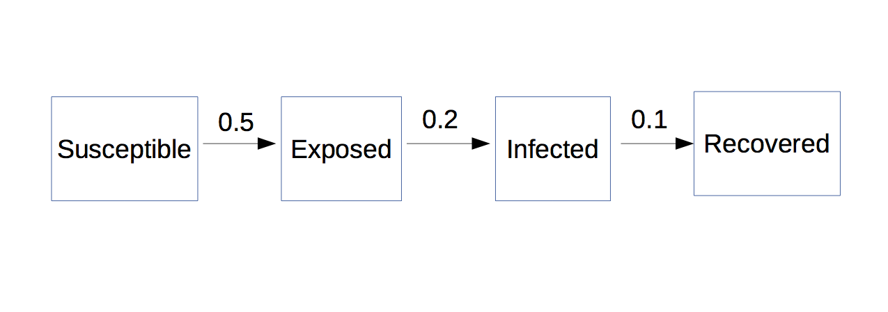

### Using the diagram package

You will need to first install the `diagram` package, and then load it in to your workspace,
```{r}
library(diagram)
```

Consider the following transition matrix,
```{r}
A <- matrix(c(0, 0, 0, 0,
              0.5, 0, 0, 0,
              0, 0.2, 0, 0, 
              0, 0, 0.1, 0), 4, 4, byrow = TRUE)
rownames(A) <- colnames(A) <- c("susceptible", "exposed", "infected", "recovered")
A
```
This means that a `susceptible` individual becomes `exposed` at a rate of `0.5`, for example.  We can visualize this matrix using the `plotmat` function in the `diagram` package,
```{r}
plotmat(A, pos = 4, box.size = 0.08)
```
The `pos = 4` tells `plotmat` that there should be `4` boxes per row.

Now we introduce a `killed` box,
```{r}
B <- cbind(rbind(A, c(0, 0, 0.01, 0)), rep(0, 5))
rownames(B)[5] <- colnames(B)[5] <- "killed"
B
```
It is no longer possible to have every box on the same row, and so things get a bit more complicated.  In particular, we need to specify an entire matrix for the `pos` argument.  Here is how we go about it,
```{r}
Bpos <- matrix(c(0.1, 0.3,
                 0.35, 0.3, 
                 0.6, 0.3, 
                 0.85, 0.3,
                 0.6, 0.8), 5, 2, byrow = TRUE)
rownames(Bpos) <- rownames(B) # naming helps my brain!
colnames(Bpos) <- c("x", "y") # naming helps my brain!
Bpos
```
This says that we want to put the `susceptible` box at the x-y coordinates given by `0.10` and `0.3`.  We can now plot the diagram,
```{r}
plotmat(B, pos = Bpos, box.size = 0.08)
```

### Use some other drawing program

This way isn't as much fun!  But you could just make a `png` file in another program and load it in to R markdown:

